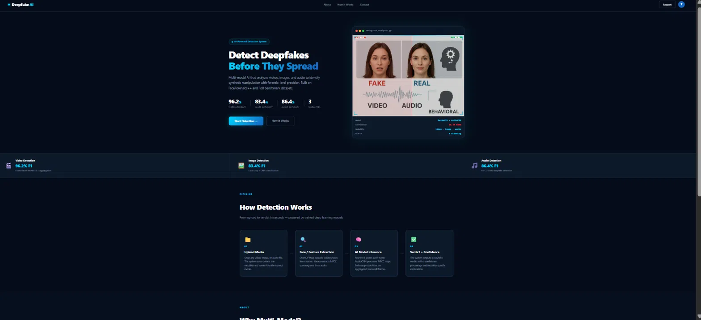
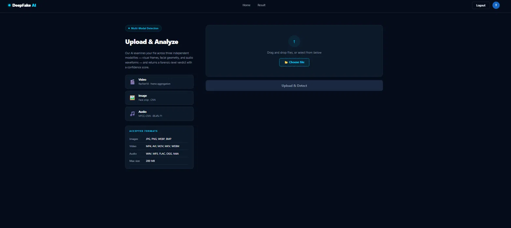
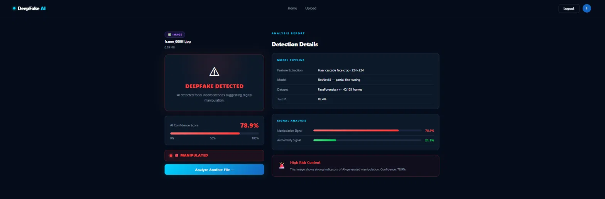
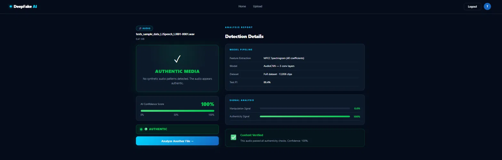

# 🕵️ Multi-Modal Deepfake Detection

**AI-powered deepfake detection across video, image, and audio — live and deployed.**

[](https://multi-modal-deepfake-detection.vercel.app/)
[](https://multi-modal-deepfake-detection.onrender.com)
[](#license)

🔗 **Live App:** [multi-modal-deepfake-detection.vercel.app](https://multi-modal-deepfake-detection.vercel.app/)
🔗 **Backend API:** [multi-modal-deepfake-detection.onrender.com](https://multi-modal-deepfake-detection.onrender.com)

> ⚠️ **Note:** The backend is hosted on Render's free tier, so the first request after a period of inactivity may take 30–60 seconds while the server spins up.

---

## 📖 Overview

Multi-Modal Deepfake Detection is a full-stack web application that analyzes **video, image, and audio** files to identify synthetic/manipulated (deepfake) content using deep learning. Instead of relying on a single signal, the system runs independent models across three modalities — visual frames, facial geometry, and audio waveforms — and returns a forensic-level verdict with a confidence score.

Built with a React frontend and a Node.js/Express backend, the app is trained on the **FaceForensics++** and **FoR (Fake or Real)** benchmark datasets and exposes a clean upload → analyze → verdict pipeline.

---

## 📸 Screenshots

### Landing Page
Model accuracy stats, detection pipeline overview, and multi-modal capability highlights.



### Upload & Analyze
Drag-and-drop interface supporting images, video, and audio uploads.



### Detection Results
Confidence scoring, manipulation vs. authenticity signal breakdown, and model pipeline details.




---

## ✨ Features

- 🎯 Detects deepfake content in **images, video, and audio**
- 🧠 Multi-modal detection pipeline for higher accuracy (video, image, audio scored independently)
- 📊 Confidence scoring with manipulation vs. authenticity signal breakdown
- ⚡ Fast inference — upload to verdict in seconds
- 💻 React frontend with a clean, user-friendly interface
- 🔗 Node.js/Express backend with RESTful API endpoints
- 🗄️ MongoDB for storing user data and analysis history
- 🧪 Postman collection included for API testing
- ☁️ Fully deployed — frontend on Vercel, backend on Render

### Model Performance

| Modality | Model | Test F1 |
|----------|-------|---------|
| Video | ResNet18 (frame-level aggregation) | **96.2%** |
| Image | ResNet18 (face-crop + CNN) | **83.4%** |
| Audio | MFCC + CNN | **86.4%** |

### How Detection Works

1. **Upload Media** — Drop any image, video, or audio file; the system auto-detects the modality and routes it to the correct model.
2. **Face / Feature Extraction** — OpenCV Haar cascade isolates faces from frames; MFCC spectrograms are extracted from audio.
3. **AI Model Inference** — ResNet18 scores each frame; an audio CNN processes MFCC maps. Softmax probabilities are aggregated across all frames.
4. **Verdict + Confidence** — The system outputs a real/fake verdict with a confidence percentage and modality-specific explanation.

---

## 🛠️ Tech Stack

**Frontend**
- React (Vite)
- Deployed on **Vercel**

**Backend**
- Node.js, Express
- Deployed on **Render**
- Python (model inference — ResNet18 / CNN via PyTorch/TensorFlow)

**Database**
- MongoDB

**AI / ML**
- ResNet18 — image & video frame classification
- MFCC + CNN — audio deepfake classification
- OpenCV Haar Cascade — face/feature extraction
- Trained on FaceForensics++ and FoR (Fake or Real) datasets

**API Testing**
- Postman

---

## 🚀 Live Deployment

| Service | Platform | URL |
|---------|----------|-----|
| Frontend | Vercel | https://multi-modal-deepfake-detection.vercel.app/ |
| Backend / API | Render | https://multi-modal-deepfake-detection.onrender.com |

---

## 💻 Local Installation

Prefer to run it locally? Follow these steps.

### 1. Clone the repository

```bash
git clone https://github.com/yourusername/multi-modal-deepfake-detection.git
cd multi-modal-deepfake-detection
```

### 2. Backend Setup

```bash
cd backend
npm install
```

Create a `.env` file in the `backend` folder:

```env
PORT=5000
MONGO_URI=mongodb://127.0.0.1:27017/deepfakeDB
PYTHON_PATH=python   # or python3, depending on your system
UPLOAD_DIR=uploads
```

Start the backend server:

```bash
npm run dev
```

### 3. Frontend Setup

```bash
cd ../frontend
npm install
npm run dev
```

The app will open at `http://localhost:5173` (or similar port).

---

## 📋 Usage

1. Visit the [live app](https://multi-modal-deepfake-detection.vercel.app/) (or your local instance).
2. Sign up or log in.
3. Upload an image, video, or audio file (JPG, PNG, WEBP, BMP · MP4, AVI, MOV, MKV, WEBM · WAV, MP3, FLAC, OGG, M4A — max 200MB).
4. View the AI-based deepfake detection results, including confidence score and signal breakdown.
5. Results are stored in MongoDB for future reference.

---

## 📁 Folder Structure

```
multi-modal-deepfake-detection/
├── backend/            # Node.js backend
│   ├── app/
│   ├── models/
│   ├── routes/
│   └── server.js
├── frontend/           # React frontend
│   └── src/
│       └── assets/     # App screenshots used in this README
└── README.md
```

---

## 🤝 Contributing

1. Fork the repository.
2. Create a new branch: `git checkout -b feature/your-feature`.
3. Make your changes and commit: `git commit -m "Add your feature"`.
4. Push to the branch: `git push origin feature/your-feature`.
5. Open a Pull Request.

---

## 📄 License

This project is licensed under the MIT License.

---

## 🙏 Acknowledgements

- FaceForensics++ and FoR (Fake or Real) benchmark datasets
- Deep learning models for deepfake detection (ResNet18, MFCC-CNN)
- React, Node.js, Express, MongoDB documentation
- Postman for API testing
- Deployed with Vercel and Render
